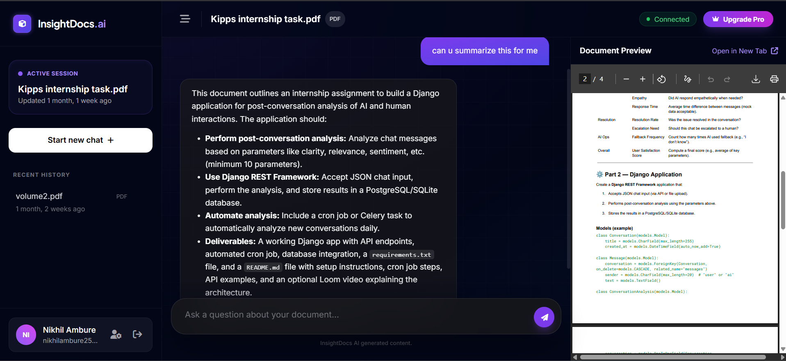
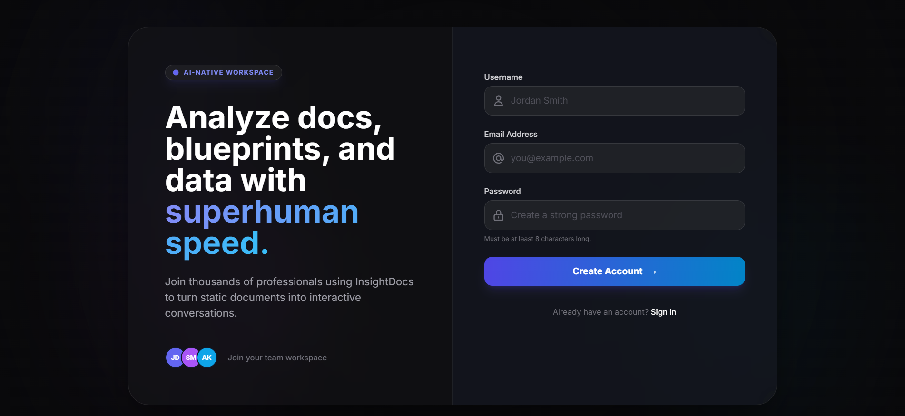
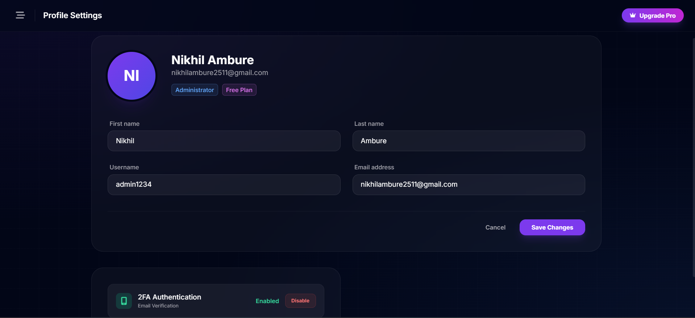
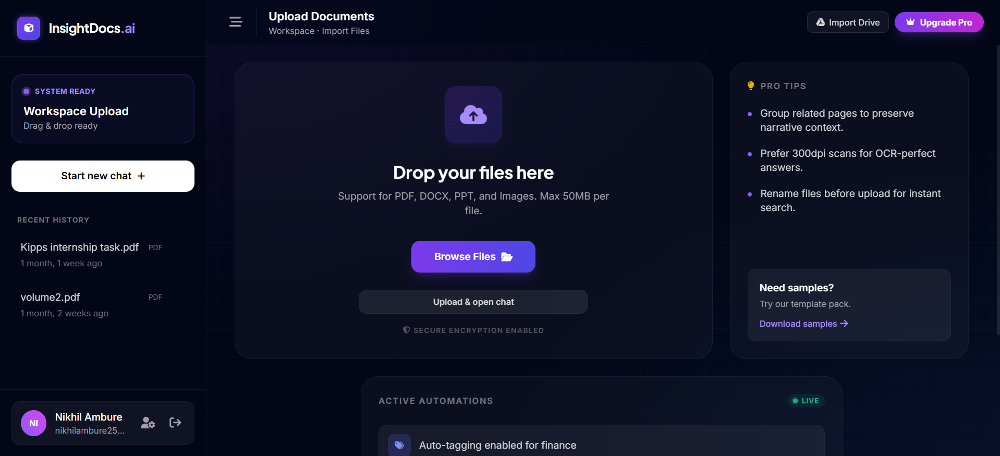
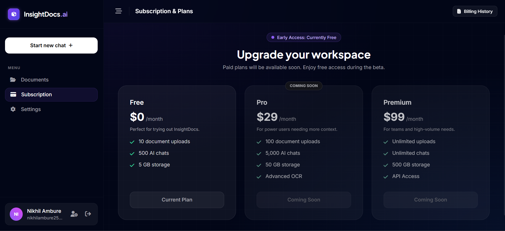

# InsightDocs AI 🧠📄

**InsightDocs AI** is an intelligent SaaS platform that transforms static documents into active conversations. By leveraging Google's **Gemini 2.5 Flash** and advanced RAG (Retrieval-Augmented Generation) with vector embeddings, users can upload contracts, research papers, presentations, or reports and interact with them using natural language to extract insights, summaries, and answers instantly.

> 🚧 **Work in Progress:** This project is currently live but under active construction. Features, UI, and database schemas are being refined daily.

## 🔗 Live Demo

Check out the live deployment here: **[insightdocs.in](https://insightdocs.in)**

---

## 📸 Project Tour

Here is a glimpse of the InsightDocs AI experience:

| **Landing Page** | **Chat Interface** |
|:---:|:---:|
|  |  |

<details>
<summary>👀 View more screenshots</summary>

### Secure Authentication (Signup)


### User Profile


### Document Upload


### Subscription Plans


</details>

---

## ✨ Key Features

* **📄 Multi-Format Ingestion:** Robust support for PDF, DOCX, TXT, PPTX, PPT files, and images (with OCR) using `PyMuPDF`, `python-docx`, `python-pptx`, and `pytesseract`.
* **🔍 Advanced RAG System:** Vector-based semantic search using **pgvector** with Gemini embeddings (`text-embedding-004`) for precise document retrieval.
* **🤖 Intelligent Chat:** Powered by **Google Gemini 2.5 Flash** for high-speed, context-aware Q&A with intelligent fallback strategies.
* **⚡ Real-Time Interaction:** Built with **Django Channels** and **Redis** for seamless, low-latency WebSocket communication.
* **🔐 Secure Authentication:** Complete signup/login system with OTP verification (via Resend), password recovery, and 2FA support.
* **☁️ Cloud Storage:** Integrated **Cloudinary** storage for handling media and static assets efficiently.
* **🎨 Futuristic UI:** A responsive, cinematic interface built with **Tailwind CSS** and vanilla JavaScript.
* **📊 Smart Rate Limiting:** Configurable safeguards to manage upload frequency and API usage.
* **⚙️ Background Processing:** Celery-powered async document processing and embedding generation.

## 🛠️ Tech Stack

| Category | Technology |
|:--- |:--- |
| **Backend** | Python, Django 5.2, Django REST Framework |
| **AI Model** | Google Generative AI (Gemini 2.5 Flash) |
| **Embeddings** | Gemini text-embedding-004 (768 dimensions) |
| **Vector Database** | pgvector (PostgreSQL extension) |
| **RAG Framework** | LangChain (Text Splitting) |
| **Real-time** | Django Channels, Daphne, Redis |
| **Task Queue** | Celery (Background tasks) |
| **Database** | PostgreSQL with pgvector (Production), SQLite (Local Dev) |
| **Storage** | Cloudinary (Media/Static) |
| **Frontend** | HTML5, Tailwind CSS, JavaScript |
| **Infrastructure** | Railway (Hosting), Whitenoise |

---

## 🚀 Local Development Setup

Follow these steps to get the project running locally.

### Prerequisites

* Python 3.10+
* Redis (Required for WebSockets/Celery)
* PostgreSQL with pgvector extension (Recommended for production; SQLite for local dev)
  * **Note:** Vector search features require PostgreSQL with pgvector. For local development, you can use SQLite, but RAG functionality will be limited.

### Installation

1. **Clone the repository:**
   ```bash
   git clone https://github.com/NikhilAmbure/InsightDocs_AI
   cd InsightDocs_AI

```

2. **Create and activate a virtual environment:**
```bash
python -m venv venv
# Windows
venv\Scripts\activate
# macOS/Linux
source venv/bin/activate

```


3. **Install dependencies:**
```bash
pip install -r requirements.txt

```


4. **Set up Environment Variables:**
Create a `.env` file in the root directory.
*Note: The project requires Cloudinary keys for file storage.*
```env
# Core Security
DEBUG=True
SECRET_KEY=your_secret_key_here

# Database & Cache
DATABASE_URL=sqlite:///db.sqlite3
REDIS_URL=redis://127.0.0.1:6379/0

# AI & Email
GOOGLE_API_KEY=your_gemini_api_key
RESEND_API_KEY=your_resend_api_key

# Cloudinary (Required for file storage)
CLOUDINARY_CLOUD_NAME=your_cloud_name
CLOUDINARY_API_KEY=your_api_key
CLOUDINARY_API_SECRET=your_api_secret

# Rate Limiting (Optional settings)
UPLOAD_RATE_LIMIT=5
UPLOAD_RATE_WINDOW=60

```


5. **Run Migrations:**
```bash
python manage.py migrate

```


6. **Start Redis (Required):**
Ensure your local Redis server is running.
```bash
redis-server

```

7. **Start Celery Worker (Optional but Recommended):**
For background document processing, start a Celery worker:
```bash
celery -A InsightDocs_AI worker --loglevel=info

```

8. **Run the Server:**
```bash
python manage.py runserver

```

**Note:** For production or full RAG functionality, ensure PostgreSQL with pgvector extension is set up. The vector search features require pgvector for optimal performance.


---

## 📂 Project Structure

```text
InsightDocs_AI/
├── accounts/              # User authentication & Profile management
│   ├── models.py         # Custom User model with 2FA & Premium flags
│   ├── views.py          # Auth views (signup, login, OTP)
│   ├── tasks.py          # Celery tasks for email sending
│   └── emailer.py        # Email utilities (Resend integration)
├── documents/            # Document processing & RAG implementation
│   ├── models.py         # Document, DocumentChunk, ChatSession models
│   ├── views.py          # Document upload & management views
│   ├── consumers.py      # WebSocket consumers for real-time chat
│   ├── tasks.py          # Celery tasks for document processing
│   └── utils/
│       ├── rag.py        # RAG processing (chunking & embeddings)
│       ├── gemini_chat.py # Gemini chat with vector search
│       └── storage.py    # File storage utilities
├── InsightDocs_AI/       # Project settings & URL routing
│   ├── settings.py       # Django configuration
│   ├── asgi.py          # ASGI config for Channels
│   ├── celery.py        # Celery configuration
│   └── urls.py          # URL routing
├── static/               # CSS, JS, and Images
├── templates/            # HTML templates
├── manage.py             # Django CLI
└── requirements.txt      # Project dependencies

```

## 🧠 How It Works

### RAG (Retrieval-Augmented Generation) Architecture

1. **Document Upload & Processing:**
   - User uploads a document (PDF, DOCX, PPTX, etc.)
   - Text is extracted using format-specific parsers
   - Document is chunked using LangChain's `RecursiveCharacterTextSplitter`
   - Each chunk is embedded using Gemini's `text-embedding-004` model (768 dimensions)
   - Embeddings are stored in PostgreSQL with pgvector extension

2. **Query Processing:**
   - User asks a question via WebSocket
   - Query is embedded using the same embedding model
   - Vector similarity search (L2 distance) retrieves top 5 most relevant chunks
   - Retrieved context is passed to Gemini 2.5 Flash along with chat history
   - Response is streamed back in real-time

3. **Fallback Strategy:**
   - If RAG processing isn't complete or no relevant chunks found, the system falls back to general knowledge mode
   - Gemini still provides helpful responses using its training data

### Technology Highlights

- **Vector Search:** Fast semantic search using pgvector's L2 distance metric
- **Async Processing:** Celery handles document processing in the background
- **Real-time Streaming:** WebSocket connections for instant, streaming responses
- **Multi-format Support:** Handles documents, presentations, and images with OCR

## 🗺️ Roadmap

* [x] **Core:** Basic Document Upload & Parsing
* [x] **AI:** Gemini Integration with Context Awareness
* [x] **Auth:** User Accounts & OTP Verification
* [x] **Real-time:** WebSockets for Chat
* [x] **Deployment:** Live on Railway
* [x] **Vector Store:** Vector embeddings with pgvector and Gemini embeddings
* [x] **RAG System:** Semantic search and retrieval-augmented generation
* [x] **Multi-Format Support:** PDF, DOCX, TXT, PPTX, PPT, and image OCR
* [ ] **Monetization:** Stripe integration for Pro subscriptions
* [ ] **Multi-Doc Chat:** Querying across multiple files simultaneously
* [ ] **2FA Enhancement:** Complete two-factor authentication UI/UX

## 🤝 Contributing

Contributions are welcome! Please follow these steps:

1. Fork the repository.
2. Create a new branch.
3. Commit your changes.
4. Push to the branch.
5. Open a Pull Request.

---

**Developed by Nikhil Ambure**

```

```